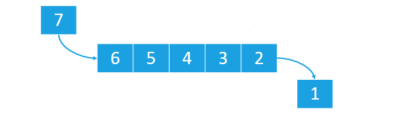

## QUEUE implementation  

Implementing a <b>QUEUE</b> data structure is <b>useful</b> when you want to create a service that serves its   
users according to the <b>FIFO</b> method.    
     
The <b>FIFO</b> method is a method that serves (<i><b>FO - First Out</b></i>) first the first element arrived   
in the QUEUE (<i><b>FI - First In</b></i>) and only after the others   
(<i>in chronological order of insertion into the QUEUE</i>).    

   
  

   

   
  

 
A possible implementation of this data structure could concern, for example, an <b>assistance system</b> provided   
through <b>ticketing</b>.    
In such a system we would have that:    
- once the <b>tickets</b> have been <b>resolved</b>, the QUEUE is <b>emptied</b>    
- when <b>new requests</b> for assistance <b>arrive</b>, the QUEUE <b>fills up</b>.      
     
The <i><b>STACK</b></i> is instead a data structure that uses the <i><b>LIFO</b></i> method, which is a method   
that serves first (<i><b>FO - First Out</b></i>) the last element that has been inserted into the STACK itself   
(<i><b>LI - Last In</b></i>).    

  
  

