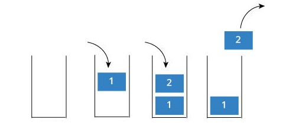

## STACK implementation

    
Implementing a <b>STACK</b> data structure is <b>useful</b> when you want to create a service that serves your    
users according to the <b>LIFO</b> method.    
       
The <b> LIFO </b> method is a method that serves (<i><b>FO - First Out</b></i>) first the last element inserted in     
the STACK (<i><b>LI - Last In</b></i>) and backwards all the others (<i> in reverse chronological order </i>). 

    
    

    
    

       
      

 
A possible implementation of this data structure could concern, for example, the use of a <b>recursive function</b> 
for the calculation of the <b>factorial</b>. In this case, we will have that:
<ul><li>in each <b>inductive case</b> the result of the function <b>fills the stack</b></li>
<li> once the <b> base case </b> is reached, the recursion ends and the calculation of the <b>factorial</b> is 
<b>performed</b>, <b>emptying the stack</b> in <b>reverse chronological order</b> and multiplying all the elements 
present. </li> </ul>        
   
The <i><b>QUEUE</b></i> is instead a data structure that uses the <i><b>FIFO</b></i> method, which is a method     
that serves (<i><b>FO - First Out</b></i>) first the first element arrived in the QUEUE (<i><b>FI - First In</b></i>) 
and only after the others (<i>in chronological order of insertion into the QUEUE itself</i>).

